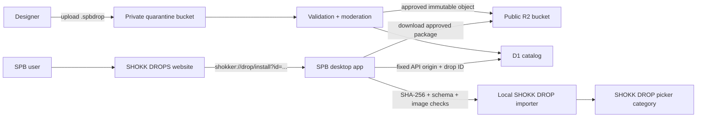

# SHOKK DROPS Community Exchange

**Status:** Feasibility approved; implementation not started  
**Date:** 2026-09-06  
**Owner ask:** Give designers a free/cheap public place to upload SHOKK DROPS so other SPB users can browse them and click once to add them to the main app's **SHOKK DROP** category.

## Decision

Build it. SPB already contains most of the difficult local product path:

- a data-and-image finish package format: `.spbdrop`;
- single and bundled export;
- pack upload/import;
- persistent per-user storage;
- runtime registry refresh;
- the existing **SHOKK DROP** picker category;
- previews, health checks, and Import DNA gauntlet results;
- an Electron `shokker://` protocol handler that can launch or focus the app.

The missing product is a remote, moderated catalog and a hardened install bridge. This is an extension of SHOKK DROP, not a new finish engine.

## Important package distinction

| Format | Existing purpose | Community exchange use |
|---|---|---|
| `.spbdrop` | One or more image-authored finishes, their spec assets, manifest metadata, DNA, and preview | **Yes. This is the exchange package.** |
| `.shokk` | A saved Paint Booth session with zone configuration and optional paint/spec output | No. Keep this for full booth-session sharing. |

Using `.spbdrop` means approved downloads already land in `%APPDATA%/ShokkerPaintBooth/user_imports`, register under the `ui_` namespace, and appear in **SHOKK DROP**.

## Customer experience

### Designer

1. In SPB, choose **Publish this DROP** from a SHOKK DROP card.
2. SPB exports the `.spbdrop` and opens the submission page.
3. The designer signs in by email, adds title, description, tags, license/usage permission, and uploads the pack.
4. The listing enters **Pending review**. It is not public yet.
5. After automated checks and owner/moderator approval, the card becomes public.

### SPB user

1. Browse the website by designer, newest, popular, paint style, color, or tags.
2. Open a card with large paint/spec previews, creator credit, version, file size, and compatibility.
3. Click **ADD TO SPB**.
4. Windows asks to open Shokker Paint Booth the first time. SPB opens to a concrete install sheet showing the exact drop, author, preview, size, and review status.
5. Click **Add**. SPB downloads, verifies, imports, refreshes the registry, and selects the new card inside **SHOKK DROP**.

The website also offers **Download `.spbdrop`** for manual import and offline transfer.

## Recommended architecture



### Hosting

- **Frontend:** add a `/drops` section to the existing SPB website. The current site can stay where it is.
- **Catalog and upload API:** Cloudflare Worker.
- **Package and preview storage:** Cloudflare R2, with separate private `quarantine` and public `approved` buckets.
- **Listings, creators, moderation, versions, download counts:** Cloudflare D1.
- **Authentication:** email magic link or a single OAuth provider for submitters. Browsing and downloading stay public.

This stack can begin at roughly **$0/month**. Current Cloudflare free allowances include 10 GB-month of R2 standard storage, 1 million R2 Class A requests, 10 million Class B requests, free direct R2 egress, 100,000 Worker requests per day, and 5 GB of D1 storage. The 15 existing local `.spbdrop` samples measure 3.49–20.58 MB with a 14.13 MB median, so 10 GB is roughly 724 median-size packages before previews and old versions. Several hundred approved drops fit comfortably. Sources: [R2 pricing](https://developers.cloudflare.com/r2/pricing/), [Workers pricing](https://developers.cloudflare.com/workers/platform/pricing/), and [D1 pricing](https://developers.cloudflare.com/d1/platform/pricing/).

If the service outgrows free limits, Workers Paid begins at a $5 monthly minimum; R2 standard storage beyond the free allowance is currently $0.015 per GB-month. Cost alarms and upload quotas must be configured before public launch.

## One-click install contract

The website button should use a narrow deep link:

```text
shokker://drop/install?id=drp_01J...&version=3
```

It must not include an arbitrary download URL or local path. SPB resolves the ID against one pinned HTTPS API origin.

Proposed sequence:

1. Electron receives the deep link and queues it until the main renderer is ready.
2. The renderer opens an install sheet and calls the local loopback server with the public `drop_id` and `version`.
3. The local server requests signed catalog metadata from the fixed community API.
4. It permits only an approved package hosted on the pinned download origin.
5. It streams to a temporary file with a strict byte limit and timeout.
6. It compares file size and SHA-256 with the approved catalog record.
7. It validates the `.spbdrop` package before touching live user storage.
8. It imports with atomic writes, refreshes the runtime registry, and returns the locally assigned `ui_*` finish ID.
9. The UI opens **SHOKK DROP**, selects the installed finish, and reports creator/version provenance.

Manual downloads use the same validator and importer.

## Public catalog record

```json
{
  "schema": "spb-community-drop/1",
  "id": "drp_01JEXAMPLE",
  "version": 3,
  "status": "approved",
  "title": "Midnight Static",
  "creator": {
    "id": "cr_01JDESIGNER",
    "display_name": "Designer Name"
  },
  "description": "Fine static filaments with a wet metallic flash.",
  "tags": ["black", "electric", "metallic"],
  "license": "SPB-COMMUNITY-PERSONAL-USE-1",
  "spb_min_version": "10.1.0",
  "package": {
    "bytes": 12873452,
    "sha256": "<64 lowercase hex characters>",
    "url": "https://drops-cdn.example/approved/drp_01JEXAMPLE/v3.spbdrop"
  },
  "previews": {
    "card": "https://drops-cdn.example/previews/drp_01JEXAMPLE/v3-card.webp",
    "paint": "https://drops-cdn.example/previews/drp_01JEXAMPLE/v3-paint.webp",
    "spec": "https://drops-cdn.example/previews/drp_01JEXAMPLE/v3-spec.webp"
  },
  "quality": {
    "validator": "spb-drop-validator/1",
    "gauntlet_passed": true,
    "reviewed_at": "2026-09-06T00:00:00Z"
  }
}
```

The package remains immutable after approval. Every update creates a new version, object key, size, checksum, and moderation decision.

## Required validation before public approval

The current local `import_pack_zip()` is suitable for trusted/manual packs but is too permissive for a public repository. The community path needs a stricter validator:

- maximum compressed package size, uncompressed size, member count, filename length, and compression ratio;
- one valid UTF-8 `manifest.json`, known schema version, one entry for the first MVP;
- allowlisted metadata fields with bounded string/tag lengths;
- PNG assets only, with exact allowlisted filenames based on the manifest ID;
- Pillow decode/verify plus dimension, channel, and pixel-count limits;
- no paths, links, executables, scripts, nested archives, HTML, SVG, or unexpected files;
- unique ID handling and atomic staging before commit;
- package SHA-256, approved catalog match, and provenance stored locally;
- automated SHOKK DROP health check and Import DNA gauntlet;
- malware scan as defense in depth;
- moderator preview of paint, combined spec, and separate M/R/Cc channels;
- report, takedown, and creator-block controls.

Community packages remain data and raster images. They never contain Python, JavaScript, shaders, plugins, or executable finish logic.

## Moderation policy for the first release

Start curated. Allow submissions from the interested designer and a few invited creators; let everyone browse and install approved drops. This gives SPB the sharing loop without opening an unmoderated file host.

Each listing needs:

- original-work or authorized-work confirmation;
- an explicit usage license;
- creator credit that stays attached after installation;
- content and trademark rules;
- an owner-controlled approve/reject/takedown action;
- immutable audit fields for submitter, reviewer, version, checksum, and timestamps.

Ratings, comments, creator payouts, private messaging, arbitrary user uploads, and automatic publication should wait until the install and moderation loop is proven.

## App work, isolated by file lane

Likely new modules:

- `server_routes/community_drop_routes.py` — catalog proxy, install, installed-state, and uninstall/update endpoints;
- `engine/paint_v2/community_drop_validator.py` — strict ZIP/manifest/image validation and staged import;
- `js/finishes/community-drop-install.js` — deep-link queue, install sheet, progress, error, and picker selection;
- `tests/test_community_drop_validator.py` — traversal, zip-bomb, malformed-image, checksum, schema, and atomicity cases;
- `tests/test_community_drop_routes.py` — pinned origin, timeout/size, approved-state, version, and install behavior;
- focused Electron tests for cold-start and already-open deep links.

Small existing bridges would need surgical edits:

- `electron-app/main.js` — recognize `shokker://drop/install`, retain it through cold start, and forward only parsed ID/version data;
- `electron-app/preload.js` — use its existing allowlisted `deep-link` event; no Node access is exposed;
- `paint-booth-v2.html` — load the new client module;
- `scripts/runtime-sync-manifest.json` — package the new modules into the installer.

The existing `.spbdrop` exporter/importer and **SHOKK DROP** registry remain the local source of truth. No finish-renderer or core catalog rewrite is required.

## Website API for the MVP

| Method | Route | Purpose |
|---|---|---|
| `GET` | `/v1/drops` | Approved listing search and pagination |
| `GET` | `/v1/drops/:id` | Approved listing, current version, checksums, previews |
| `POST` | `/v1/submissions` | Create authenticated pending submission |
| `POST` | `/v1/submissions/:id/upload` | Issue bounded upload authorization for quarantine |
| `POST` | `/v1/submissions/:id/complete` | Seal upload and queue validation |
| `GET` | `/v1/me/submissions` | Creator submission status |
| `POST` | `/v1/admin/submissions/:id/approve` | Publish immutable approved version |
| `POST` | `/v1/admin/submissions/:id/reject` | Reject with reason |
| `POST` | `/v1/drops/:id/report` | File a takedown/moderation report |

Download counts should use an idempotent or sampled endpoint so refreshing a page does not inflate popularity.

## Delivery sequence

### Phase 0 — invited-designer proof

- Harden `.spbdrop` validation locally.
- Validate several real packs from the interested designer.
- Create a static approved catalog with 5–10 cards and manual `.spbdrop` downloads.
- Add the deep-link install path and prove closed-app and already-open-app flows.
- Verify every installed pack appears in **SHOKK DROP** and renders/exports correctly.

This proves the customer value before building accounts or uploads.

### Phase 1 — curated public exchange

- Add creator login and quarantine uploads.
- Add moderator review/approval.
- Add website search, designer pages, versions, downloads, reports, and update badges.
- Add **Browse Community Drops** and **Publish this DROP** links inside SPB.

### Phase 2 — community growth

- Favorites/collections synced across devices;
- opt-in update notifications;
- creator analytics;
- verified creator badges;
- optional paid drops or tips only after ownership, refunds, licensing, tax, and platform-fee rules are designed.

## MVP acceptance gate

The proof is complete only when:

1. An invited designer exports a real `.spbdrop`, submits it, and receives a pending status.
2. The validator rejects malicious and malformed fixtures without changing live user storage.
3. Approval produces an immutable public package and catalog record with matching SHA-256.
4. A clean buyer machine clicks **ADD TO SPB** with the app closed, confirms the concrete preview, and installs it.
5. The finish appears under **SHOKK DROP**, renders at 2048², exports paint/spec correctly, and survives app restart.
6. Re-clicking the same version reports **Installed** without duplicating it; a new approved version offers an explicit update.
7. Manual `.spbdrop` download/import reaches the same validated result.
8. Revoking a listing blocks new installs while leaving already-installed local art under the user's control.

## Recommendation

Proceed with the invited-designer Phase 0 first. It gives the designer a public page and gives buyers a real **ADD TO SPB** button with minimal operational risk. Use the existing website for the browse surface and Cloudflare Worker + R2 + D1 for the exchange backend. Keep publication curated until the validator, attribution, takedown, and upgrade paths have been proven on clean buyer installations.

## Implementation status — 2026-09-07

The owner authorized the full curated exchange and the working MVP is now built.

- The existing companion Site now has `/drops`, `/drops/submit`, and an owner-only `/drops/review` queue. ChatGPT sign-in identifies submitters; contact information remains private to the owner.
- D1 holds review state and public metadata. R2 holds quarantined `.spbdrop`, base-paint preview, and spec-preview objects. Only an explicit owner approval exposes the public metadata, preview, and download routes.
- The upload boundary checks package/member limits, flat safe filenames, duplicate/case collisions, supported schema/category, exactly one paint finish, required paint/spec/preview PNGs, PNG headers/dimensions, and SHA-256. The desktop independently checks the byte count and SHA-256, then reopens every PNG with Pillow before touching the personal library.
- `shokker://drop/install?id=<id>&version=1` works for an already-open app and is retained during cold start. SPB shows the approved author and both previews before installation, resolves downloads only against the fixed Sites origin, installs idempotently, and refreshes the SHOKK DROP gallery.
- Local end-to-end proof passed: authenticated submit → pending/private → owner review → approved/public metadata/previews/download → SPB metadata proxy → first install → repeat install with one library entry. Six focused malicious-pack and idempotence tests, JavaScript syntax checks, Site lint, and the production build pass.
- Public Site version 6 is deployed at `https://shokker-paint-booth.downndirtytn.chatgpt.site/drops`. Ronald Lyons' public Beta Shock Drops directory supplied 29 owner-approved packs: every source download and curated copy passed strict validation; every curated manifest carries Ronald Lyons / Lyons Designs attribution; D1/R2 exposes 29 approved records with 58 verified paint/spec previews and matching SHA-256 values; all 29 are installed in the live local SHOKK DROP library under unique public IDs. The actual `:59876` app route passed production metadata, checksum, image verification, and repeat-install idempotence.
- Version 6 makes the install boundary explicit: **ADD TO SPB** lets the desktop resolve `%APPDATA%\ShokkerPaintBooth\user_imports`, verify the package and register it under SHOKK DROP; manual downloads direct users through Shokk Drop Lab instead of telling them to copy into the managed folder. The exchange now exposes HOT, MOST DOWNLOADED, LATEST and RATING rankings. Signed-in members have one mutable 1–5 rating per account and drop; anonymous writes are rejected. The D1 migration, local signed-in create/update flow, all four APIs, production 29-record catalog, previews and anonymous authorization boundary passed. `RESEND_API_KEY` and `RESEND_FROM_EMAIL` remain the only missing production configuration for automatic review email.
- **Client compatibility correction:** the live public desktop release is 10.0.1, cut at commit `aa3efc85` before the community deep-link/install changes in `3526f9f7`. Version 10.0.1 already imports downloaded `.spbdrop` packages through Shokk Drop Lab, but it does not recognize `shokker://drop/install`, fetch the fixed-origin community listing, or present the community confirmation modal. One-click therefore requires the next 10.0.2 client patch. Site version 7 now states this boundary on the guide and every ADD TO SPB button so the public page does not overpromise before that desktop update ships.
- **Homepage navigation correction:** Site version 8 replaces the SHOKK DROPS header item's unreliable client-router transition with an explicit same-origin full-page navigation. The link keeps its real `/drops` href for pre-hydration and accessibility behavior, then calls `window.location.assign('/drops')` after hydration. This prevents the Vinext client shell from swallowing the click while leaving the homepage hash-navigation items untouched. Final proof used the deployed Chrome homepage at `/#fractured-paints`: after a cold reload, clicking the visible SHOKK DROPS header link changed the same tab to `/drops` and exposed the live 29-card exchange.
