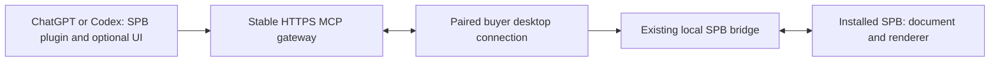

# SPB buyer plugin: decision and first pilot — 2026-10-04

**Recommendation: keep the existing MCP and package an SPB plugin around it.**
MCP exposes the application's actions. A plugin adds installation identity,
SPB-specific skills and optional interactive views. Adding a plugin alone does
not move SPB's renderer or Windows files into ChatGPT.

## Buyer experience and delivery order

| Experience | Execution | What is required | Current state |
|---|---|---|---|
| Talk to Codex while installed SPB changes live | Buyer's PC | Existing local bridge, Node, enabled SPB, supported model | Documented connection exists; local plugin pilot prepared here |
| Work with previews, finish cards and controls inside ChatGPT | ChatGPT view; SPB runs on buyer's PC | MCP App UI, public authenticated MCP gateway, paired outbound desktop connection | Proposed next product increment; not implemented |
| Use the full painting workspace entirely in a browser | Hosted SPB runtime | Hosted rendering, document storage, tenant isolation, resource limits, adapted editor | Separate larger product scope; not implied by installing a plugin |

Ship a qualified local Codex connection first. Pilot plugin installation in a
clean buyer profile; retain the existing Connect Codex route while testing.
Then build one ChatGPT workspace for live preview, named-part selection,
catalog comparison, change review/Undo and verified downloads. Reuse the actual
SPB tools; rendering and document authority remain in SPB. A complete embedded
editor can follow after the focused workflow works. Broad control and dependable
outcomes matter more than adding overlapping tools or letting an assistant run
arbitrary scripts by default.

## Existing integrations inspected

- `mcp/server/index.js`: production, dependency-free Node stdio adapter. Uses
  the per-user pairing token, loopback SPB API and actual open page bridge.
  Tool metadata comes from `mcp/server/tools.json`. Existing Connect Codex and
  Claude `.mcpb` setup use this adapter.
- `integrations/spb-mcp/`: separate Python/Playwright controller with private
  browser sessions, screenshots, gestures and app scripting. It is useful for
  advanced workflows but has a different session model and dependencies.
  It is not the adapter behind the existing Connect Codex buyer setup.
- The initial plugin copies the Node adapter without changing either bridge,
  rebuilding `.mcpb`, restarting SPB or touching the buyer's current paint.
  Build provenance and freshness checks prevent the copied server silently
  drifting at build time. New adapter releases require rebuilding this package.

## Proposed public ChatGPT connection

This topology is an engineering recommendation, not a service already present
in the repo. The buyer signs into SPB, proves purchase entitlement and pairs one
desktop installation. The desktop connection initiates outbound requests; the
gateway routes each authenticated buyer to their own explicitly selected device
and document. Keep the current local bridge private. Do not send everyone to
Ricky's machine or give them a shared pairing token.

Use one document authority with existing stable-target guards, editing leases,
read/write scopes and true Undo. Reconnects must not replay completed painting
commands: use unique request IDs, completion records and a current document
generation. Report offline devices honestly. Separate assistant requests from
manual edits and offer an explicit takeover flow. Return bounded state and
requested images/artifacts; protect download links per buyer and give them an
expiry. Preserve consent for previews leaving the PC and let buyers revoke the
desktop connection.

OAuth for the gateway and entitlement/device pairing are separate from the
buyer's OpenAI account. Keep credentials outside the package. SPB should not
read ChatGPT login tokens. Inference limits follow the chosen host/account;
running a gateway still creates hosting and support costs. A free-to-buyer
plugin is possible as a business choice, not proof of zero operating cost.

## Platform constraints verified on October 4

- Plugins can package skills and MCP connections. Local/repo source availability
  varies by host. A local process needs the machine runtime; installing a plugin
  on the web does not deploy executable code on the buyer's PC.
  [Official packaging](https://developers.openai.com/plugins/build/plugins).
- ChatGPT supports MCP App components in an iframe with a host bridge. Start
  with useful tools and add preview/selection UI; optional extensions can add
  sidebar or file-viewer entrypoints. Host capabilities must be detected and
  verified; do not promise identical UI in every Codex client.
  [Official UI guide](https://developers.openai.com/plugins/build/chatgpt-ui).
- Public directory submission needs a stable publicly reachable HTTPS MCP
  endpoint with Streamable HTTP. This local stdio package is a private pilot,
  not a public submission candidate.
  [Endpoint requirements](https://developers.openai.com/plugins/build/mcp-server).
- Secure MCP Tunnel can support a private/dev test of a private server and
  requires tunnel configuration and runtime credentials. It does not qualify
  as public plugin distribution. Do not make every buyer's installation a
  manual development tunnel setup.
  [Tunnel limitations](https://developers.openai.com/api/docs/guides/secure-mcp-tunnels).

## Pilot artifacts and verification boundaries

Source: `integrations/spb-plugin/shokker-paint-booth-local/`.
Builder: `integrations/spb-plugin/build_plugin.py`.
Private archive: `integrations/spb-plugin/shokker-paint-booth-local-0.1.0.zip`.
Package identity, painting skill and MCP configuration are portable; a matching
compatibility manifest/config covers older Codex layouts. The ZIP contains only
an explicit file allowlist, original branding, source adapter snapshots and
source hashes. It contains no pairing token, buyer paint, installed credentials,
renderer catalog or SPB installer.

The pilot needs native host installation and harmless status/preview proof in
a clean local Codex profile. Protocol discovery and schema validation are
necessary but do not establish a host connection or painting correctness.
Known October 2 application acceptance failures—spec-only overlays restoring
source paint and a composer left disabled—must be rechecked against fixes from
the active AI lane. They are inherited app issues, not solved by plugin packaging.
See `docs/CODEX_MCP_SUPPORT_2026-10-01.md`; do not overwrite its active lane.

Public release needs the gateway, buyer account/entitlement and device pairing,
the actual MCP UI, isolated buyer tests and review metadata (real support,
privacy and terms URLs, reviewer access and working demonstrations). Choose
hosting and identity integration only after checking the existing SPB licensing
system. No public upload, deployment or private-account save is part of this
pilot preparation.

## Session verification

- Built the 10-file, 125,535-byte private ZIP. Both root manifests validate
  against their official Agent Plugins 1.0 schemas. JSON/skill/presentation and
  compatibility consistency checks pass, as do Python/Node syntax checks and
  archive integrity. Original packaged branding is reused without alteration.
- The copied production server passes a real stdio initialization, ping,
  discovery of 27 tools and two prompts, and required tool/schema checks.
  Source/copy SHA-256 checks pass before and after the audit.
- A live `spb_status` call through the packaged adapter succeeds without painting.
  `resources/list` is empty, confirming that this pilot has no embedded UI.
- Native Codex plugin installation, image delivery through that plugin and
  clean-buyer painting acceptance remain unverified. The installed CLI supports
  marketplace registration but no direct plugin-install command was shown;
  existing user configuration was left untouched.

Machine-readable evidence: `integrations/spb-plugin/verification.json`.
Reproduce: `python integrations/spb-plugin/build_plugin.py --validate-schemas`
then `node integrations/spb-plugin/verify_plugin.cjs --live-status`.
